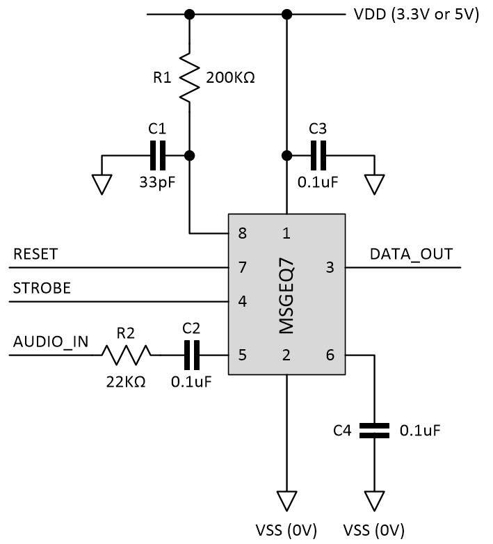

# LED-Visualizer (JLC PCB Board)

## Update

> 

 - I Re-Prototyped the MSGEQ7 Circuit with a different reference circuit - On a Prototype Board.

 - Will be Updating Results & Circuit.

**DO NOT USE MY FILE TO PRINT**

 - **1. Error with GND Tracing Thickness**
 - **2. MSGEQ7 Circuit Not Working**

## Source Files

**DO NOT USE MY FILE TO PRINT**

 - **1. Error with GND Tracing Thickness**
 - **2. MSGEQ7 Circuit Not Working**

## How it Works?

How it Works? : https://www.youtube.com/watch?v=ppTdXinVPAs&feature=emb_title

## Board Image (Update)

> 

# It's on my Patreon Page

Patreon Page: https://www.patreon.com/marcusthumb

# Explanation
(Adapted) MarcusThum's Board Model from: https://create.arduino.cc/projecthub/PhilKey/rgb-backlight-msgeq7-audio-visualizer-e0054e

# Source Files

## Note

**DO NOT USE MY FILE TO PRINT**

 - **1. Error with GND Tracing Thickness**
 - **2. MSGEQ7 Circuit Not Working**
