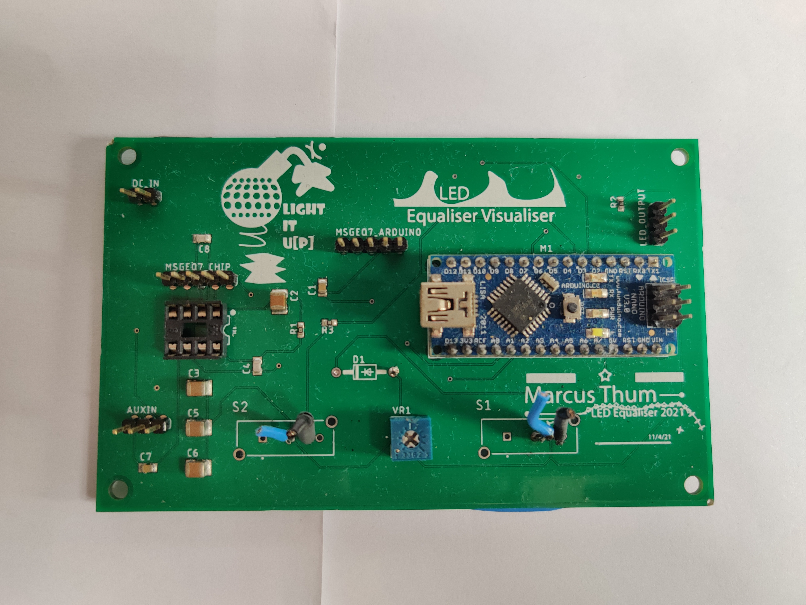
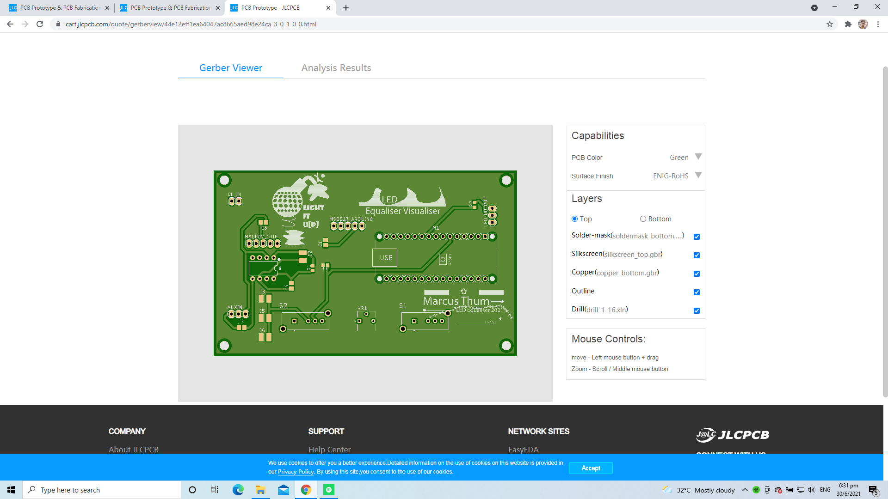

# LED-Visualizer (JLC PCB Board)

## How it Works?

How it Works? : https://www.youtube.com/watch?v=ppTdXinVPAs&feature=emb_title

## First Wrongly Traced Printed Board

> 

## Retraced Board (Have Not Printed) -> Asking for Funds

> 

# Asking for Funds/Support to RePrint Retraces Board

Fund me at my Patreon Page: https://www.patreon.com/marcusthumb

# Explanation
(Adapted) MarcusThum's Board Model from: https://create.arduino.cc/projecthub/PhilKey/rgb-backlight-msgeq7-audio-visualizer-e0054e

# Source Files

**rgbstripe_msgeq7_2021-06-30.zip** -> Board File

**BOM.xlsx** -> BOM Table

**CPL.xlsx** -> Position of Surface Mount Components

## Note
Please note that **BOM.xlsx** AND **CPL.xlsx** can only be used on the PCB Making Platform JLC PCB.
