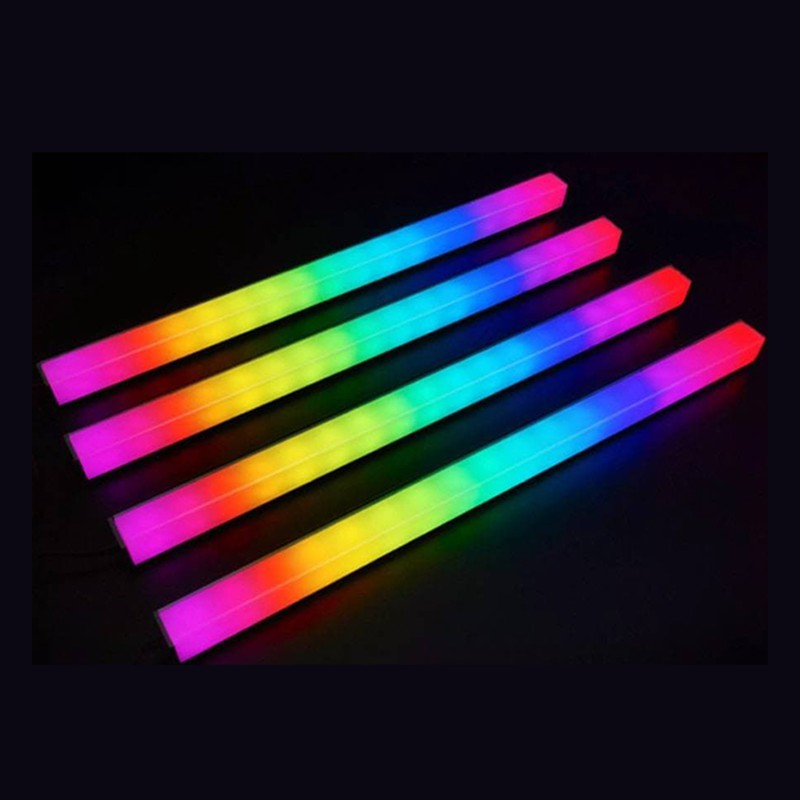

# LED-Visualizer (JLC PCB Board)

## Update

> 

- I have completed the the project with a working personal LED Music Visualizer.

**If anyone is keen to learn**

 - **1. Contact me**

## Buying Completed Product

Shoppee: https://shopee.sg/product/253127738/5885516277?smtt=0.107637913-1630238169.3

## How it Works?

How it Works? : https://www.youtube.com/watch?v=ppTdXinVPAs&feature=emb_title

# Explanation
(Adapted) MarcusThum's Board Model from: https://create.arduino.cc/projecthub/PhilKey/rgb-backlight-msgeq7-audio-visualizer-e0054e
