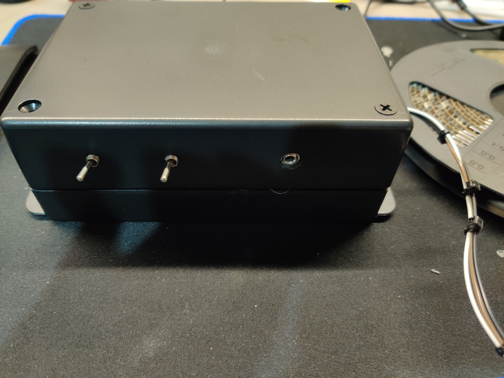

# Marcus LED-Visualizer

## Update

> 
> 

I have completed my LED Music Visualizer.

## Video of my Setup in Action

Video Of It Working: https://youtu.be/rOyJxB7BaPw

## How it Works?

How it Works? : https://www.youtube.com/watch?v=ppTdXinVPAs&feature=emb_title

# Explanation
(Adapted) MarcusThum's Board Model from: https://create.arduino.cc/projecthub/PhilKey/rgb-backlight-msgeq7-audio-visualizer-e0054e
